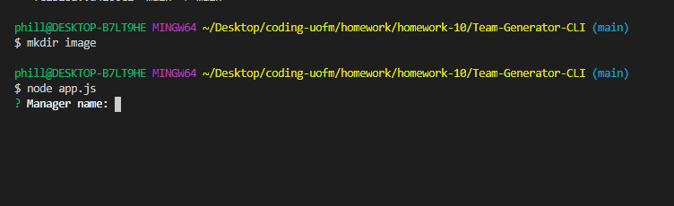
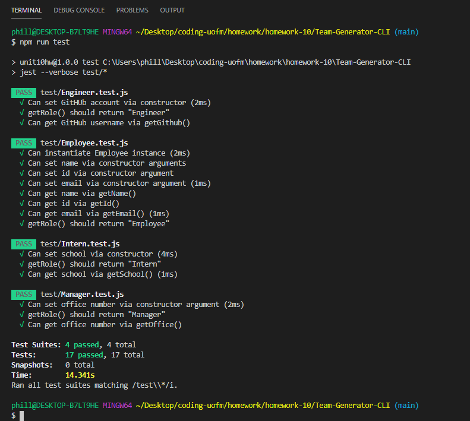

# Team-Generator-CLI
Did you ever want a place where you can add team members and have all their info in one easy-to-find location? Well now youhave one! Using our app, all you need to do is answer a series of questions, and your very own team hub will be generated for you!
 
## Screenshots

## How to use?
Open the command line, and type, 'node app.js', hit 'enter', and you will be given a series of prompts to answer. Once you have finished answering all the prompts, a new html file will be generated with all the members of your team! You can view an instructional video [here](https://drive.google.com/file/d/1B6mKdXCyHvtRd2exauJ2VAjfmCAa3wDU/view) 
and the Github repo [here!](https://github.com/phillipmerriman/Team-Generator-CLI)

© 2020 [Phillip Merriman](https://github.com/phillipmerriman)